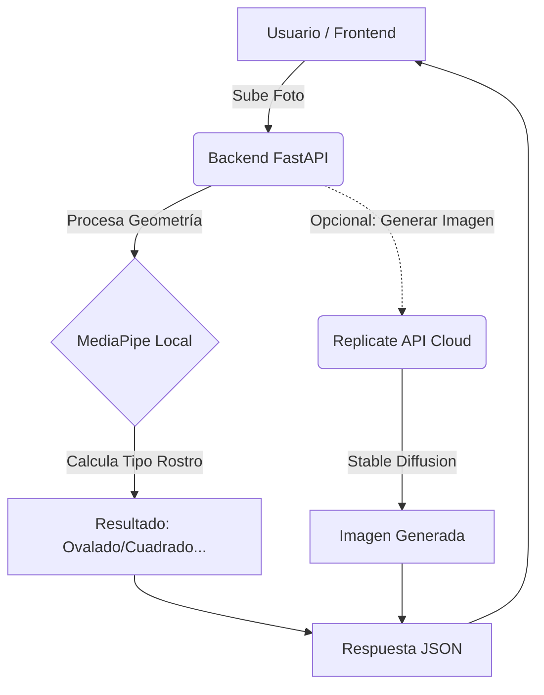

# 📄 Propuesta Técnica: Arquitectura de IA Híbrida
**Proyecto:** Análisis Biométrico y Recomendación de Estilismo
**Fecha:** 2 de Febrero, 2026

---

## 1. 🎯 Resumen Ejecutivo

Para cumplir con los requerimientos de análisis facial y generación de imágenes fotorrealistas de manera eficiente y escalable, proponemos una **Arquitectura Híbrida**. Esta solución combina el procesamiento local ligero (para rapidez) con la potencia de la nube (para calidad gráfica), garantizando compatibilidad en todos los equipos de desarrollo.

---

## 2. 🛠️ Stack Tecnológico Propuesto

### A. Análisis Biométrico (Procesamiento Local)
**Tecnología:** [Google MediaPipe Face Mesh](https://developers.google.com/mediapipe/solutions/vision/face_mesh)

*   **Función:** Detección de 468 puntos faciales (landmarks) en tiempo real.
*   **Justificación:**
    *   **Costo:** Open Source (Gratuito).
    *   **Rendimiento:** Optimizado para correr en CPU (móviles y laptops estándar).
    *   **Uso:** Nos permite calcular la geometría del rostro (mandíbula, pómulos) para determinar si es "Ovalado", "Cuadrado", etc., sin latencia de red.

### B. Generación de Estilos (Procesamiento en Nube)
**Tecnología:** [Replicate API](https://replicate.com/) (Stable Diffusion)

*   **Modelo:** `stability-ai/stable-diffusion-inpainting` (o similar optimizado para retratos).
*   **Función:** Generar visualizaciones del usuario con el nuevo corte de cabello aplicado.
*   **Justificación:**
    *   **Hardware:** Elimina la necesidad de que cada desarrollador o usuario tenga una tarjeta gráfica (GPU) costosa de 8GB+ VRAM.
    *   **Calidad:** Acceso a modelos SOTA (State of the Art) fotorrealistas.
    *   **Simplicidad:** Se integra mediante una simple petición REST, evitando instalaciones complejas de PyTorch/CUDA.

### C. Backend Integrador
**Tecnología:** Python + FastAPI

*   **Función:** Orquestador central.
    1.  Recibe la imagen del Frontend.
    2.  Ejecuta **MediaPipe** localmente para obtener metadatos.
    3.  Envía la imagen + prompt ("hombre con corte pompadour") a **Replicate** si el usuario solicita la visualización.
    4.  Devuelve los resultados consolidados al cliente.

---

## 3. 📊 Diagrama de Flujo

---

## 4. ✅ Ventajas de esta Solución

| Característica | Solución Local Pura (TensorFlow/PyTorch) | Solución Híbrida (Propuesta) |
| :--- | :--- | :--- |
| **Instalación** | Compleja (conflictos de versiones y Drivers) | Sencilla (`pip install fastpi google-mediapipe`) |
| **Requisitos HW** | PC Gamer / Servidor con GPU | Laptop estándar de oficina |
| **Velocidad** | Lenta en CPU | Rápida (Análisis local instantáneo + Nube potente) |
| **Costo** | Gratuito (pero costoso en tiempo dev) | Bajo costo por imagen generada (céntimos) |

---

## 5. 📝 Conclusión

La arquitectura híbrida es el estándar moderno para aplicaciones que requieren IA generativa sin sacrificar la experiencia de usuario ni complicar el entorno de desarrollo del equipo. Recomendamos proceder con **MediaPipe** para la lógica de negocio y **Replicate** para el factor visual "wow".
